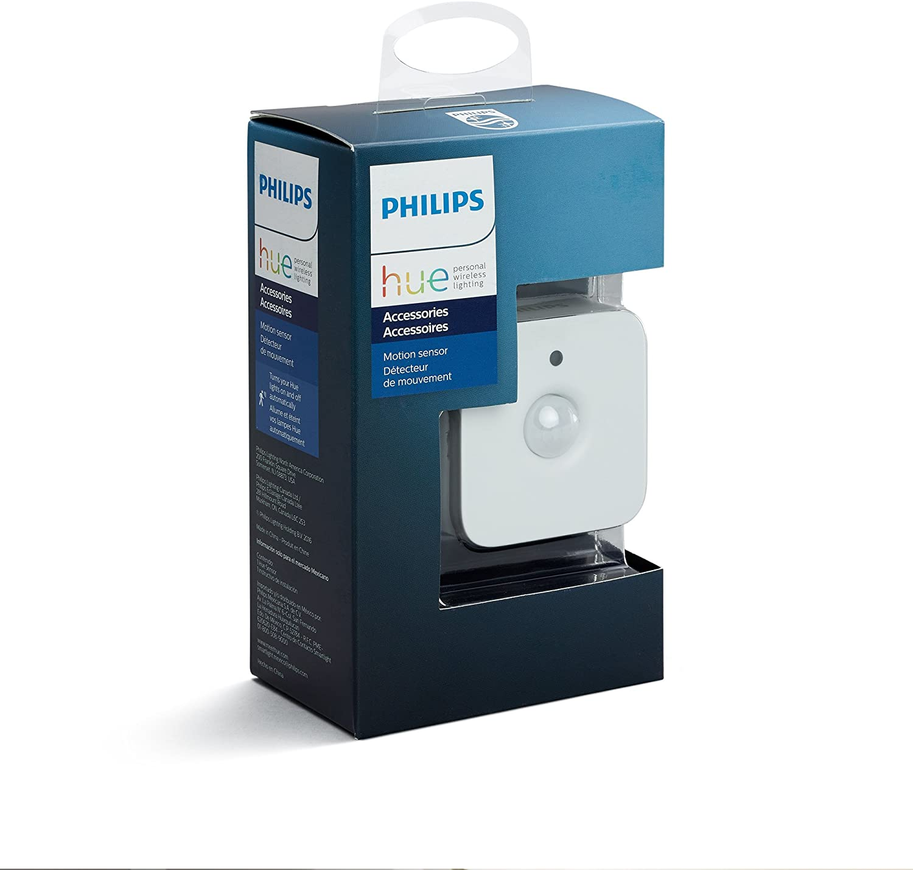
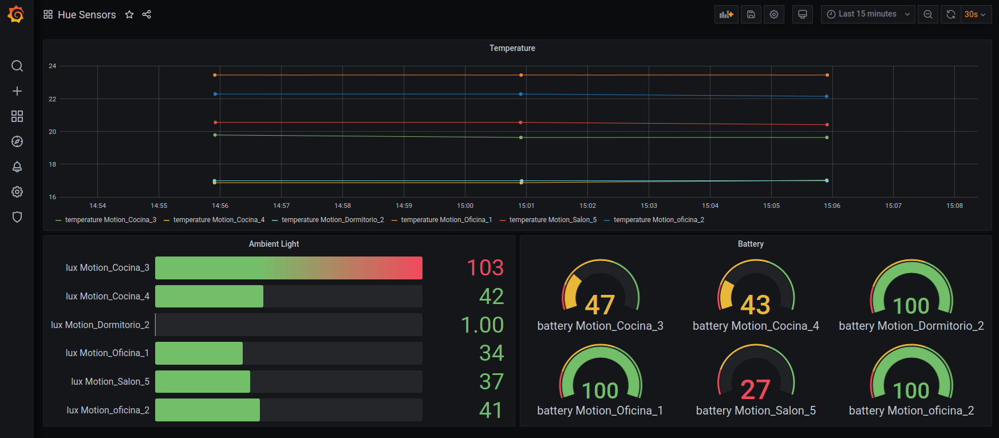

# Hue temp to InfluxDB

Based on https://github.com/dariusjs/gohue

Sends data read from Philips Hue smart motion sensors to InfluxDB.




## Grafana Demo



## Docker

Edit `env-file` to add the required values.

```
docker build -t huetemp .
docker run --env-file env-file huetemp
```

## Hue Bridge account creation

Get the bridge IP with `curl https://discovery.meethue.com/`

Press the Hue bridge button and:

```
curl -d '{"devicetype":"huetemp"}' --header "Content-Type: application/json" --request POST http://bridge-ip/api
```

to get an API key.
